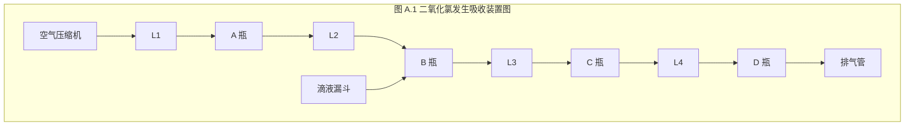

ICS 11.080
CCS C 59

GB logo

# 中华人民共和国国家标准

**GB/T 26366—2021**
代替 GB/T 26366—2010

# 二氧化氯消毒剂卫生要求

Hygienic requirements for chlorine dioxide disinfectant

2021-08-20 发布
2022-03-01 实施
国家市场监督管理总局
国家标准化管理委员会 发布

---

NO_CONTENT_HERE

---

GB/T 26366—2021

# 前 言

本文件按照 GB/T 1.1—2020《标准化工作导则 第 1 部分：标准化文件的结构和起草规则》的规定起草。

本文件代替 GB/T 26366—2010《二氧化氯消毒剂卫生标准》，与 GB/T 26366—2010 相比，除结构调整和编辑性改动外，主要技术变化如下：

——适用范围删除了对二氧化氯来源和生产工艺（见第 1 章，2010 年版的第 1 章）；
——修改了规范性引用文件（见第 2 章，2010 年版的第 2 章）；
——修改了术语和定义，修改了二氧化氯消毒剂的定义，删除了二氧化氯活化剂、中和和一般物体表面的定义（见第 3 章，2010 年版的第 3 章）；
——增加了硫酸氢钠要求（见 4.7）；
——修改了理化指标中有效成分含量要求（见 5.1.1，2010 年版的 5.1 和 5.3）；
——删除了消毒后水的指标要求（见 2010 年版的 5.2）；
——增加了理化指标中 pH 值、片重误差和崩解时限要求（见 5.1.2、5.1.4 和 5.1.5）；
——修改了杀灭微生物指标（见 5.2，2010 年版的 5.5）；
——修改了应用范围，使用方法，运输、贮存和包装，标签、标识和说明书（见第 6 章、第 7 章、第 9 章、第 10 章，2010 年版的第 6 章、第 7 章、第 9 章、第 10 章、第 11 章、第 12 章）；
——修改了含量测定方法（见附录 A，2010 年版的附录 A）；
——增加了 pH 值、片重误差和崩解时限测定方法（见 8.2、8.4、8.5）。

请注意本文件的某些内容可能涉及专利。本文件的发布机构不承担识别专利的责任。

本文件由中华人民共和国国家卫生健康委员会提出并归口。

本文件起草单位：上海市疾病预防控制中心、上海市消毒品协会、中国疾病预防控制中心环境与健康相关产品安全所、国家卫生健康委卫生健康监督中心、中国人民解放军疾病预防控制所、黑龙江省疾病预防控制中心、深圳市疾病预防控制中心、浙江省疾病预防控制中心、上海市卫生健康委员会监督所、中国检验检疫科学研究院、广州海关技术中心。

本文件主要起草人：田靓、李华、朱仁义、李涛、孙守红、林玲、朱子犁、胡国庆、周晓鹏、帖金凤、任哲、杨艳伟、罗嵩、张卓娜、慈颖、廖如燕、吴予奇、王式鸿、宋恒志、陈小平、龙膺厚、王兴玉、陈海畴、蔡金海、邓金花、毛善军、黄珊珊。

本文件及其所代替标准的历次版本发布情况为：

——2010 年首次发布为 GB 26366—2010；2017 年 3 月 23 日起，转化为 GB/T 26366—2010；
——本次为第一次修订。

I

---

NO_CONTENT_HERE

---

GB/T 26366—2021

# 二氧化氯消毒剂卫生要求

## 1 范围

本文件规定了二氧化氯消毒剂的原料要求、技术要求、应用范围、使用方法、检验方法、运输贮存和包装以及标签标识和说明书。

本文件适用于应用时为水溶液的二氧化氯消毒剂。

## 2 规范性引用文件

下列文件中的内容通过文中的规范性引用而构成本文件必不可少的条款。其中，注日期的引用文件，仅该日期对应的版本适用于本文件；不注日期的引用文件，其最新版本（包括所有的修改单）适用于本文件。

GB/T 191 包装储运图示标志

GB/T 320 工业用合成盐酸

GB/T 534 工业硫酸

GB/T 1294 化学试剂 L(+)-酒石酸

GB/T 1618 工业氯酸钠

GB/T 8269 柠檬酸

GB 18466 医疗机构水污染物排放标准

GB 27948 空气消毒剂通用要求

GB 27949 医疗器械消毒剂通用要求

GB 27952 普通物体表面消毒剂通用要求

GB/T 38497 内镜消毒效果评价方法

GB 38598 消毒产品标签说明书通用要求

HG/T 3250 工业亚氯酸钠

HG/T 4516 工业硫酸氢钠

中华人民共和国药典（2020年版）

生活饮用水消毒剂和消毒设备卫生安全评价规范（试行） 卫监督发〔2005〕336号
消毒技术规范（2002年版） 卫法监发〔2002〕282号

## 3 术语和定义

下列术语和定义适用于本文件。

### 3.1

**二氧化氯消毒剂 chlorine dioxide disinfectant**

以二氧化氯为有效杀菌成分的消毒剂。

注：包括使用前需通过化学作用活化产生二氧化氯的消毒剂和无需通过化学作用活化（免活化）即可产生二氧化氯的消毒剂。

1

---

GB/T 26366—2021

# 4 原料要求

4.1 亚氯酸钠应按 HG/T 3250 执行。

4.2 氯酸钠应按 GB/T 1618 执行。

4.3 盐酸应按 GB/T 320 执行。

4.4 硫酸应按 GB/T 534 执行。

4.5 柠檬酸应按 GB/T 8269 执行。

4.6 酒石酸应按 GB/T 1294 执行。

4.7 硫酸氢钠应按 HG/T 4516 执行。

4.8 其他原料应符合相应的国家标准、行业标准的质量要求和有关规定。

# 5 技术要求

## 5.1 理化指标

### 5.1.1 有效成分含量

需活化的二氧化氯消毒剂和免活化固体二氧化氯消毒剂的有效成分含量应为标示中位值±10%。免活化液体二氧化氯消毒剂的有效成分含量应为标示中位值±15%。

### 5.1.2 pH 值

片剂和粉剂的最高使用浓度溶液 pH 值应为标示中位值±1。需活化的液体制剂活化后 pH 值应为标示中位值±1。免活化液体制剂原液 pH 值应为标示中位值±1。

### 5.1.3 稳定性

有效期 12 个月以上。需活化的二氧化氯消毒剂和免活化固体二氧化氯消毒剂的有效成分含量下降率应小于或等于 10%，免活化液体二氧化氯消毒剂的有效成分含量下降率应小于或等于 15%，且存放后有效成分含量均不应低于产品企业标准规定含量的下限值。

### 5.1.4 片重误差

片剂的片重误差应符合《中华人民共和国药典》(2020 年版)的要求。

### 5.1.5 崩解时限

泡腾片的崩解时限应符合《中华人民共和国药典》(2020 年版)的要求。

## 5.2 杀灭微生物指标

用于水(饮用水、游泳池水和医院污水)消毒应符合《消毒技术规范》(2002 年版)、《生活饮用水消毒剂和消毒设备卫生安全评价规范》(试行)和 GB 18466 的要求。用于普通物体表面消毒应符合 GB 27952 的要求。用于医疗器械消毒应符合 GB 27949 的要求。用于内镜消毒应符合 GB/T 38497 的要求。用于空气消毒应符合 GB 27948 的要求。用于其他对象的消毒,应符合相应的国家标准或行业标准要求。

2

---

GB/T 26366—2021

# 6 应用范围

二氧化氯消毒剂适用于水（饮用水、游泳池水、医院污水）、普通物体表面、医疗器械（含内镜）、空气的消毒处理。

按产品说明书并有实验依据的产品可增加其他应用范围。

# 7 使用方法

## 7.1 消毒液的配制与活化

一元包装的粉剂开袋后立即一次性配制成液体，开袋后未使用完的粉剂不可再使用。

粉剂和片剂溶解时使用不透光的非金属广口容器。不可使用温度高于 40 ℃ 的水溶解粉剂。先在容器中加入所需水量，再加入所需粉剂量，不可反向操作。

需活化的二氧化氯消毒剂应按产品说明书规定的方法进行充分活化后方可使用。经活化后使用的消毒液应现用现配。

## 7.2 消毒方式方法

饮用水、游泳池水和医院污水采用投加的方式消毒。物体表面采用喷洒或擦拭的方式消毒。医疗器械采用浸泡的方式消毒。空气采用气溶胶喷雾或汽化或熏蒸的方式消毒。

使用剂量和作用时间应符合产品说明书的要求。

# 8 检验方法

## 8.1 有效成分含量测定

按附录 A 描述的方法执行。

## 8.2 pH 值测定

按《消毒技术规范》（2002 年版）描述的方法执行。

## 8.3 稳定性测定

按《消毒技术规范》（2002 年版）描述的方法执行。

## 8.4 片重误差测定

按《中华人民共和国药典》（2020 年版）描述的方法执行。

## 8.5 崩解时限测定

按《中华人民共和国药典》（2020 年版）描述的方法执行。

## 8.6 杀灭微生物试验

按《消毒技术规范》（2002 年版）描述的方法执行。

3

---

GB/T 26366—2021

# 9 运输、贮存和包装

## 9.1 运输

产品在运输时轻装轻卸，不倒放，防止重压、剧烈碰撞和包装破损，避免日晒、雨淋、受潮，不与影响产品质量的物品混装运输。

## 9.2 贮存

产品贮存于避光、阴凉、干燥、通风处，不与酸类、有机物、易燃物及强还原剂接触或共同存贮。

## 9.3 包装

产品的包装容器与材料符合相应的标准和有关规定。产品使用避光的容器密封包装，密封可靠不泄漏；塑料包装使用不易老化和破损、气密性好、耐腐蚀、有足够强度的材料；包装规格依用户需要确定。

# 10 标签、标识和说明书

10.1 包装标识应符合 GB/T 191 的要求。

10.2 产品标签和说明书应符合 GB 38598 的要求。

10.3 产品使用注意事项至少包括以下内容：

a) 外用消毒剂，不可口服，置于儿童不易触及处；

b) 不可与碱性物质混用；不宜与其他消毒剂或有机物混用；

c) 本品有漂白作用；

d) 使用时应戴手套；避免高浓度消毒剂接触皮肤和吸入呼吸道；如消毒剂不慎接触眼睛，应立即用水冲洗，严重者应就医。

4

---

GB/T 26366—2021

# 附 录 A
(规范性)
**二氧化氯含量测定方法**

## A.1 紫外可见分光光度法

### A.1.1 概述

本方法采用紫外可见分光光度法测定消毒剂中二氧化氯的浓度。

### A.1.2 原理

使用石英比色皿,采用紫外可见分光光度计在 190 nm～600 nm 波长范围内扫描,观察二氧化氯水溶液特征吸收峰,二氧化氯的最大吸收峰在 360 nm 处,可作为定性依据,但氯气在此也有弱吸收,产生干扰。采用二氧化氯水溶液在 430 nm 处的吸收,吸光度与二氧化氯浓度成正比,且 Cl2-、ClO2-、ClO3-、ClO-在此无吸收,可作为定量依据。

### A.1.3 试验条件

本方法最低检出浓度为 10 mg/L,适合浓度在 10 mg/L～250 mg/L 二氧化氯的测定,高浓度消毒剂可稀释后测定。

### A.1.4 试剂或材料

**A.1.4.1** 分析中所用试剂均为分析纯,用水为二次蒸馏水。

**A.1.4.2** 二氧化氯标准贮备溶液:亚氯酸钠溶液与稀硫酸反应,可产生二氧化氯。氯等杂质通过亚氯酸钠溶液除去。用恒定的空气流将所产生的二氧化氯带出,并通入纯水中配成二氧化氯标准贮备溶液,在每次使用前,其浓度以碘量法测定。二氧化氯溶液应避光、密闭,并冷藏保存。

二氧化氯溶液制备方法(见图 A.1):在 A 瓶(洗气瓶)中放入 300 mL 水,A 瓶封口上有二根玻璃管,一根玻璃管(L1)下端插至近瓶底,上端与空气压缩机相接,另一根玻璃管(L2)下端口离开液面 20 mm～30 mm,其另一端插入 B 瓶底部。B 瓶为高强度硼硅玻璃,滴液漏斗(E)下端伸至液面下,玻璃管(L3)下端离开液面 20 mm～30 mm,另一端插入 C 瓶底部。溶解 10 g 亚氯酸钠于 750 mL 水内并倒入 B 瓶中,在分液漏斗中装有 20 mL 硫酸溶液(1+9,体积比)。C 瓶结构同 A 瓶一样,瓶内装有亚氯酸饱和溶液。玻璃管(L4)插入 D 瓶底部,D 瓶为 2 L 硼硅玻璃收集瓶,瓶中装有 1 500 mL 水,用以吸收所发生的二氧化氯,余气由排气管排出。D 瓶上的另一根玻璃管(L5)下端离开液面 20 mm～30 mm,上端与环境空气相通而作为排气管,尾气由排气管排出。整套装置应放在通风橱内。

图 A.1 ClO2 发生吸收装置图

启动空气压缩机,使适量空气均匀通过整个装置。每隔 5 min 由分液漏斗加入 5 mL 硫酸溶液,在全部加完硫酸溶液后,空气流要持续 30 min。将 D 瓶中所获得的黄绿色二氧化氯标准溶液放于棕色玻

5

---

GB/T 26366—2021
A.1.4.3 二氧化氯标准溶液：取一定量新标定的二氧化氯标准贮备溶液，用二次蒸馏水稀释至所需浓度。

# A.1.5 仪器设备

A.1.5.1 紫外可见分光光度计。  
A.1.5.2 石英比色皿，精度 1 cm。  
A.1.5.3 100 mL 容量瓶。

# A.1.6 样品

按照样品说明书配制二氧化氯消毒液或其稀释液。

# A.1.7 试验步骤

## A.1.7.1 标准曲线的绘制

分别取 4.0 mL、10.0 mL、20.0 mL、40.0 mL、80.0 mL、100.0 mL 二氧化氯标准溶液（250 mg/L）于 100 mL 容量瓶中，加水至刻度，配成浓度为 10 mg/L、25 mg/L、50 mg/L、100 mg/L、200 mg/L、250 mg/L 的二氧化氯溶液，于 430 nm 处测定吸光度值，以二氧化氯浓度对吸光度值绘制标准曲线。

## A.1.7.2 样品测定

配制或稀释后的样品于 430 nm 测定其吸光度值，与标准曲线比较而定量。

# A.1.8 试验数据处理

消毒剂中二氧化氯的质量浓度按公式(A.1)计算：

$$
\rho=\frac{\rho_1}{V_1/V_2}
\qquad\qquad\qquad\cdots\cdots\cdots\cdots\cdots\cdots\cdots\cdots\cdots\cdots(A.1)
$$

式中：
- \(\rho\) —— 消毒剂中二氧化氯的质量浓度，单位为毫克每升(mg/L)；
- \(\rho_1\) —— 样品测定液中二氧化氯的质量浓度，单位为毫克每升(mg/L)；
- \(V_1\) —— 所取消毒剂原液体积，单位为毫升(mL)；
- \(V_2\) —— 定容体积，单位为毫升(mL)。

# A.1.9 精密度

在重复性条件下获得的两次独立测定结果的绝对差值不大于算术平均值的 10%。

# A.2 五步碘量法

## A.2.1 概述

本方法采用五步碘量法测定消毒剂中二氧化氯浓度的方法，可以测定消毒剂中的氯气、亚氯酸根离子、氯酸根离子的浓度。适用于由亚氯酸盐、氯酸盐为原料制成的二氧化氯消毒剂。

## A.2.2 原理

该方法是利用不同 pH 条件下 ClO2、Cl2、ClO2-、ClO3- 分别与 I- 反应来测定各响应物质的浓度。反应方程式如下：

<page_number>6</page_number>
6

---

GB/T 26366—2021
——Cl2 + 2I− = I2 + 2Cl− (pH=7, pH≤2, pH<0.1);
——2ClO2 + 2I− = I2 + 2ClO2− (pH=7);
——2ClO2 + 10I− + 8H+ = 5I2 + 2Cl− + 4H2O(pH≤2, pH<0.1);
——ClO2− + 4I− + 4H+ = 2I2 + Cl− + 2H2O(pH≤2, pH<0.1);
——ClO3− + 6I− + 6H+ = 3I2 + Cl− + 3H2O(pH<0.1)。
然后用硫代硫酸钠作滴定剂，分步滴定反应产生的 I2。
A.2.3 试验条件
A.2.3.1 本方法用于由亚氯酸盐、氯酸盐为原料制成的二氧化氯消毒剂含量测定。
A.2.3.2 本方法最低检出浓度为 0.1 mg/L。滴定过程中氧化性物质的浓度不得高于 3 000 mg/L，可根据需要将样品适当稀释。
A.2.3.3 试验操作应在室温 20 ℃～25 ℃条件下进行。
A.2.4 试剂或材料
A.2.4.1 分析中所用试剂均为分析纯,用水为无氧化性氯二次蒸馏水。
A.2.4.2 无氧化性氯二次蒸馏水:蒸馏水中加入亚硫酸钠,将氧化性氯还原为氯离子[以对氨基-N,N-二乙基苯胺(DPD)检查不显色],再进行蒸馏,所得的水为无氧化性氯二次蒸馏水。
A.2.4.3 硫代硫酸钠标准溶液(0.1 mol/L)配制:称取 26 g Na2S2O3·5H2O 于 1 000 mL 棕色容量瓶中,加入 0.2 g 无水碳酸钠,用水定容至刻度,摇匀。置暗处,30 d 后经过滤并标定其浓度。
硫代硫酸钠标准溶液标定:准确称取 120 ℃烘干至恒重的基准重铬酸钾 0.05 g～0.10 g(精确至 0.000 1 g),记录读数为 m,置于 250 mL 碘量瓶中,加蒸馏水 40 mL 溶解。加 2 mol/L 硫酸 15 mL 和 100 g/L 碘化钾溶液 10 mL,盖上盖混匀,加蒸馏水数滴于碘量瓶盖缘,置暗处 10 min 后再加蒸馏水 90 mL。用硫代硫酸钠标准溶液滴定至溶液呈淡黄色,加 5 g/L 淀粉溶液 10 滴(溶液立即变蓝),继续滴定至溶液由蓝色变成亮绿色。记录硫代硫酸钠滴定液总毫升数,同时作空白校正。硫代硫酸钠标准溶液的浓度按公式(A.2)计算:
$$c=\frac{m}{49.03\times(V_2-V_1)\times10^{-3}}$$
( A.2 )
式中:
c——硫代硫酸钠标准溶液的浓度,单位为摩尔每升(mol/L);
m——基准重铬酸钾质量数,单位为克(g);
49.03——1/6 K2Cr2O7的摩尔质量,单位为克每摩尔(g/mol);
V2——重铬酸钾消耗硫代硫酸钠标准溶液的体积数,单位为毫升(mL);
V1——试剂空白消耗硫代硫酸钠标准溶液的体积数,单位为毫升(mL)。
A.2.4.4 硫代硫酸钠标准滴定液(0.01 mol/L):吸取 10.0 mL 硫代硫酸钠标准溶液(见 A.2.4.3)于 100 mL 容量瓶中,用水定容至刻度。临用时现配。
A.2.4.5 2.0 mol/L 硫酸溶液。
A.2.4.6 100 g/L 碘化钾溶液:称取 10 g 碘化钾于 100 mL 蒸馏水中,储于棕色瓶中,避光保存于冰箱中,若溶液变黄需重新配制。
A.2.4.7 饱和磷酸氢二钠溶液:用十二水合磷酸氢二钠溶液与蒸馏水配成饱和溶液。
A.2.4.8 pH=7 磷酸盐缓冲液:溶解 25.4 g 无水 KH2PO4 和 216.7 g Na2HPO4·12H2O 于 800 mL 蒸馏水中,用水稀释成 1 000 mL。
A.2.4.9 50 g/L 漠化钾溶液:溶解 5 g 漠化钾于 100 mL 水中,储于棕色瓶中,每周重配一次。
A.2.4.10 淀粉溶液:5 g/L。
<page_number>7</page_number>

---

GB/T 26366—2021

## A.2.5 仪器设备

A.2.5.1 酸式滴定管。

A.2.5.2 50 mL、250 mL、500 mL 碘量瓶。

A.2.5.3 高纯氮钢瓶。

## A.2.6 样品

按照样品说明书将样品活化后。吸取适量样品溶液用蒸馏水稀释,使其氧化性物质浓度在 2 000 mg/L ~ 3 000 mg/L(活化后氧化性物质浓度在此浓度范围内的样品溶液可直接取样测定)。

## A.2.7 试验步骤

A.2.7.1 在 500 mL 的碘量瓶中加 200 mL 蒸馏水,吸取 2.0 mL ~ 5.0 mL 样品溶液或稀释液于碘量瓶中,加入 10.0 mL 磷酸盐缓冲液,摇匀。加入 10 mL 碘化钾溶液,用硫代硫酸钠标准滴定液滴定至淡黄色时,加 1 mL 淀粉溶液,溶液呈蓝色,继续滴至蓝色刚好消失为止,记录读数为 $V_1$。

A.2.7.2 在 A.2.7.1 滴定后的溶液中加入 10.0 mL 2.0 mol/L 硫酸溶液,置暗处 5 min,用硫代硫酸钠标准滴定液滴定至蓝色消失,记录读数为 $V_2$。

A.2.7.3 在 500 mL 的碘量瓶中加 200 mL 蒸馏水,吸取 2.0 mL ~ 5.0 mL 样品溶液或稀释液于碘量瓶中,加入 10.0 mL 磷酸盐缓冲液,摇匀,然后通入压力为 0.06 MPa 的高纯氮气,吹气时间 20 min ~ 30 min。吹气完毕后,加入 10 mL 碘化钾溶液、1 mL 淀粉溶液。若样品溶液为无色透明,则进行 A.2.7.4 操作;若溶液变为蓝色,则用硫代硫酸钠标准滴定液滴定至蓝色刚好消失为止。

A.2.7.4 在 A.2.7.3 滴定后的溶液中加入 10.0 mL 2.0 mol/L 硫酸溶液,置暗处 5 min,用硫代硫酸钠标准滴定液滴定至蓝色刚好消失为止,记录读数为 $V_3$。

A.2.7.5 在 50 mL 碘量瓶中加入 1 mL 溴化钾溶液和 20 mL 2.0 mol/L 硫酸溶液,混匀,吸取 2.0 mL ~ 5.0 mL 样品溶液于碘量瓶中,立即塞住瓶塞并混匀,置于暗处反应 20 min,然后加入 10 mL 碘化钾溶液,剧烈震荡 5 s,立即转移至装有 25 mL 饱和磷酸氢二钠溶液的 500 mL 碘量瓶中,清洗 50 mL 碘量瓶并将洗液转移至 500 mL 碘量瓶中,使溶液最后体积在 200 mL ~ 300 mL。用硫代硫酸钠标准滴定液滴定至淡黄色时,加 1 mL 淀粉溶液,继续滴至蓝色刚好消失为止。同时用蒸馏水作空白对照,得读数为 $V_4$ = 样品读数 - 空白读数。

## A.2.8 试验数据处理

$X_1$、$X_2$、$X_3$ 和 $X_4$ 分别按公式(A.3)、公式(A.4)、公式(A.5)和公式(A.6)计算:

$$X_1 = \frac{(V_2 - V_3) \times c \times 16\ 863}{V}$$ ( A.3 )

$$X_2 = \frac{V_3 \times c \times 16\ 863}{V}$$ ( A.4 )

$$X_3 = \frac{[V_4 - (V_1 + V_2)] \times c \times 13\ 908}{V}$$ ( A.5 )

$$X_4 = \frac{[V_1 - (V_2 - V_3) \div 4] \times c \times 35\ 450}{V}$$ ( A.6 )

式中:

$X_1$ —— $ClO_2$ 的浓度,单位为毫克每升(mg/L);

$X_2$ —— $ClO_2^-$ 的浓度,单位为毫克每升(mg/L);

$X_3$ —— $ClO_3^-$ 的浓度,单位为毫克每升(mg/L);

8

---

GB/T 26366—2021

$X_4$ ——Cl2 的浓度,单位为毫克每升(mg/L);
$V_1, V_2, V_3, V_4$ ——上述各步中硫代硫酸钠标准溶液用量,单位为毫升(mL);
$c$ ——硫代硫酸钠标准滴定液的浓度,单位为摩尔每升(mol/L);
$V$ ——二氧化氯溶液的样品体积,单位为毫升(mL)。

## A.2.9 精密度

在重复性条件下获得的两次独立测定结果的绝对差值不大于算术平均值的 10%。

## A.2.10 注意事项

实验操作时要防止阳光直射。准备工作要充分到位,尽可能缩短操作时间,以防止二氧化氯因挥发、分解而影响测定的准确性。

9

---

NO_CONTENT_HERE

---

NO_CONTENT_HERE

---

GB/T 26366—2021

中华人民共和国
国 家 标 准
**二氧化氯消毒剂卫生要求**

GB/T 26366—2021

\*

中国标准出版社出版发行
北京市朝阳区和平里西街甲 2 号(100029)
北京市西城区三里河北街 16 号(100045)

网址:www.spc.org.cn
服务热线:400-168-0010
2021 年 8 月第一版

\*
书号:155066 • 1-68292

版权专有 侵权必究

GB/T 26366-2021 barcode